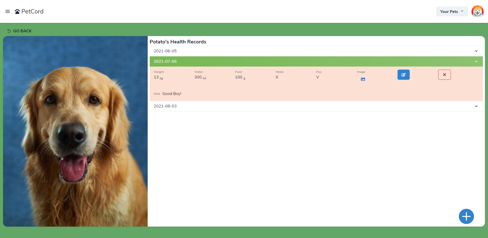
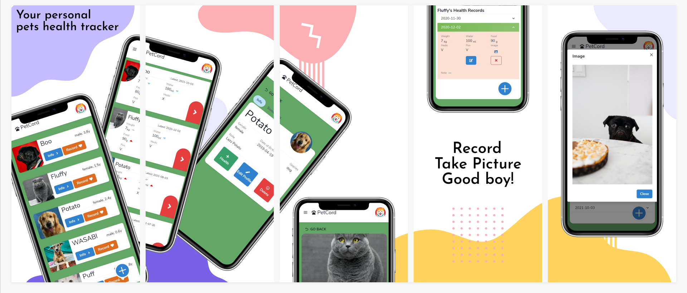
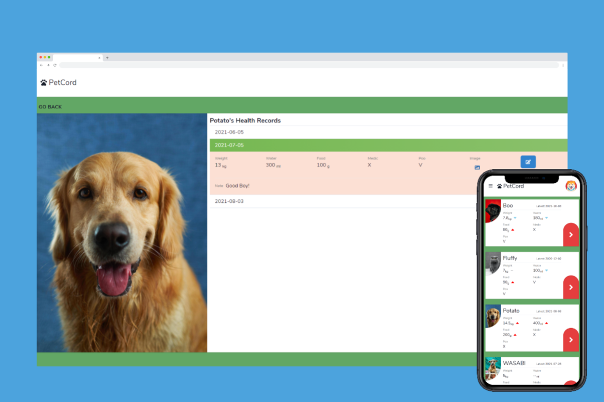

# PetCord | Your Pets Health Tracker



PetCord is a pets health tracker where you can create your own account to store your pets information, note their every detail, and record their daily health status even with a nice picture.

You got a pet need to take care? No problem!

:fire: Give it a try: https://pet-cord.web.app/

You can also login with example account to take a look

```
example@example.com
12345678
```

# Index

- [Intro](#Intro)
- [More Pictures](#more-pictures)
- [Features](#Features)
- [Tech & Package](#tech-&-package)
- [Contributors](#contributors)

# Intro

PetCord is self-side-project which develop with separation of front-end and back-end.

# More pictures





# Features

## User

### Login/Account

- Create an account with email
- Auth by firebase
- Edit user profile information
- Avatar

### Actions

- Overview all the pets
- Manage/Edit the pets information
- Track all pets health records

## Pets

### Profile

- Add/Edit every pets profile
- Note with Detail
- Avatar

### Health

- Add Health Record
- Record with Image
- Overview with the latest two records with compare

## Image/Avatar

- using Imgur API

# Tech & Package

## Front-End

Create-react-app with chakra-ui

- React
- React icon
- Chakra UI
- Redux / Redux-toolkit
- React Router
- Framer

## Back-End

### Env

- Node.js
- Express
- Multer
- Mongoose (for db)

### DateBase

- MongoDB
- Imgur (for image/avatar)

### Deploy

- Heroku
- Atlas(MongoDB)

# Contributors

[Charlie](https://github.com/wlcharlie/wlcharlie)

Feel free to contact me if there is some buggy

:email: wl00606352@gmail.com
